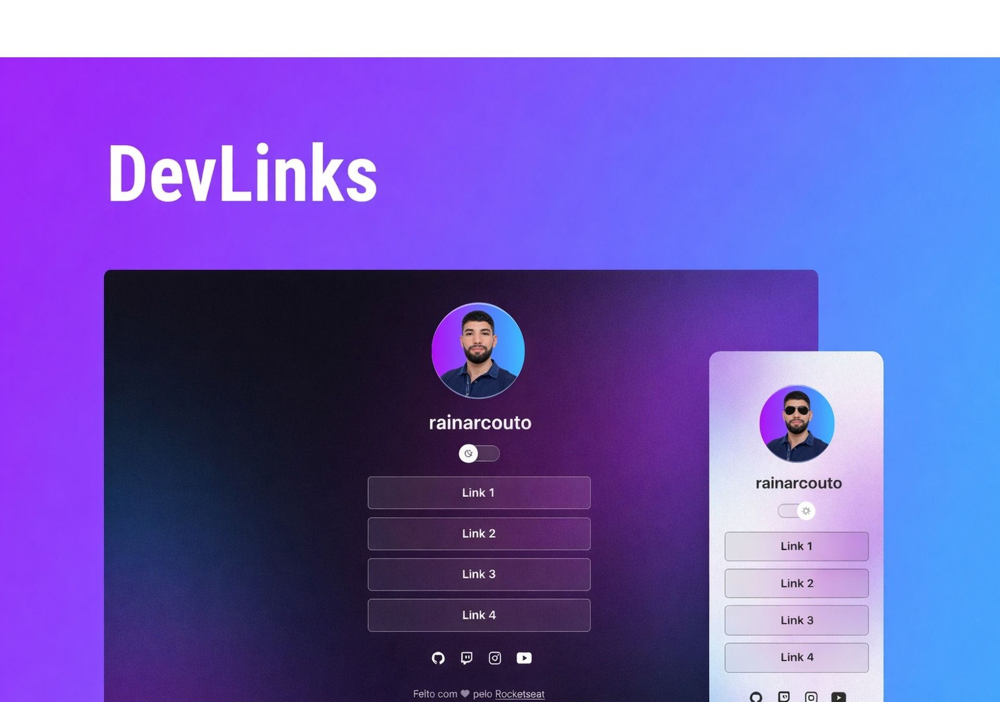

<h1 align="center"> DevLinks </h1>

 

  

## 🚀 Tecnologias

Esse projeto foi desenvolvido com as seguintes tecnologias:

- HTML e CSS
- JavaScript
- Git e Github
- Figma

## 💻 Projeto

O DevLinks é um agregador de links para usar como cartão de visitas online.

- [Acesse o projeto finalizado, online](https://rainarcouto.github.io/DevLinks/)

## :memo: Licença

Esse projeto está sob a licença MIT.

---

Feito com ♥ Rocketseat 